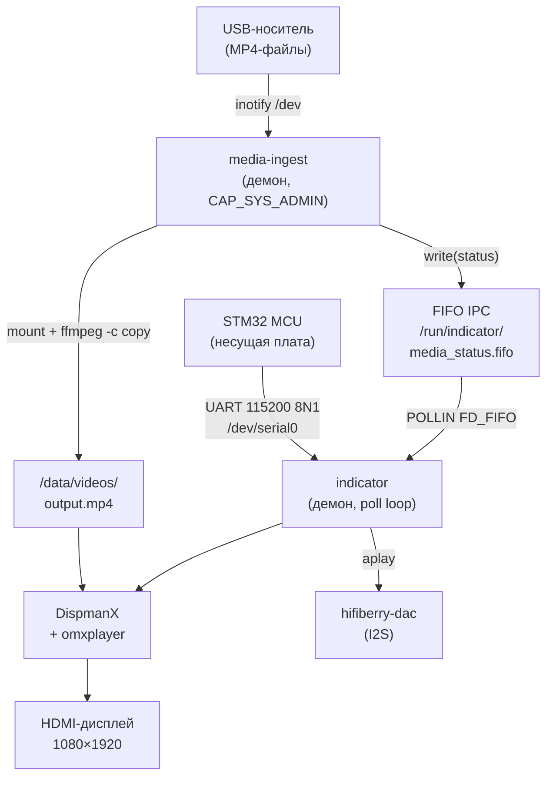
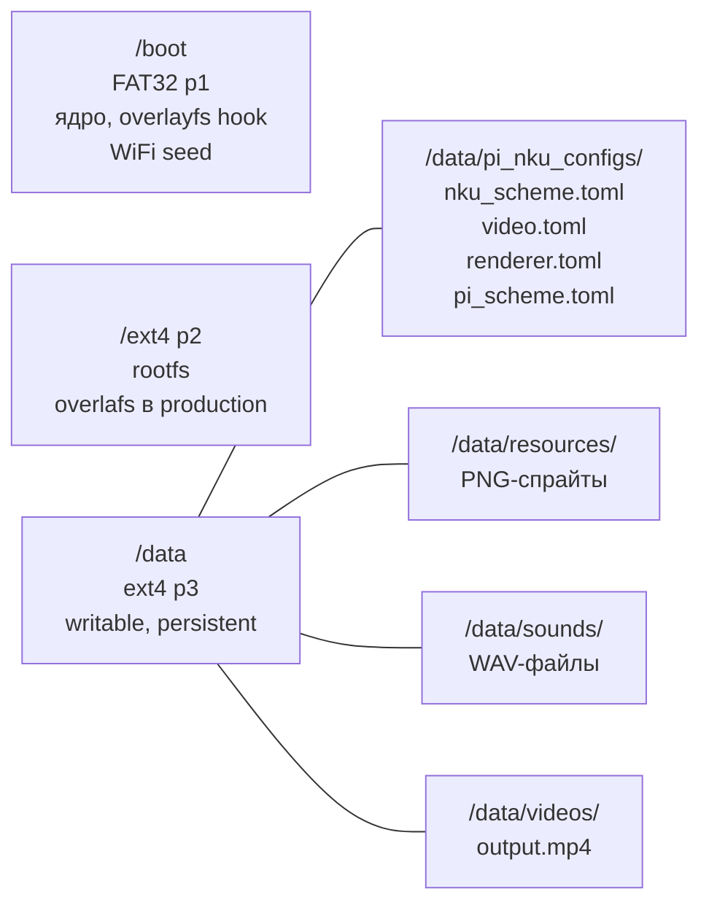
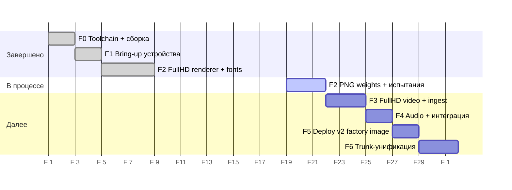

# Lift Indicator HD

Встраиваемая система отображения состояния лифта на базе Raspberry Pi Zero 2W.
Получает данные от STM32 по UART, отображает этаж и режим работы на HDMI-дисплее
1080×1920, воспроизводит голосовые объявления и позволяет обновлять фоновое видео
с USB-носителя.

---

## Возможности

- **Дисплей** — DispmanX-оверлей (7 слотов) поверх фонового видео: цифры этажа через font renderer (CalSans260), стрелка направления, иконки нештатных режимов (9 режимов), диспетчерская связь, информационные уведомления
- **Аудио** — голосовые объявления этажей (в т.ч. составные: 21–49, П1–П9, −1..−9), звуки событий, фоновая музыка; приоритетная очередь с вытеснением
- **USB Media Ingest** — замена фонового видео с FAT32/exFAT/ext4 носителя; поддержка склейки нескольких MP4-файлов; индикация прогресса на экране
- **Надёжность** — read-only rootfs (overlayfs), watchdog keepalive (VideoCore IV P-28), автоперезапуск через systemd
- **Provisioning** — factory image: уникальный hostname из SoC serial, SSH keys, WiFi seed из `/boot/`, TUI-меню настройки параметров MCU

---

## Оборудование

| Компонент | Модель |
|---|---|
| SBC | Raspberry Pi Zero 2W (BCM2710A1 · 4× Cortex-A53 · ARMv8-A 32-bit) |
| ОС | Raspbian Buster Lite 2023-05-03 (Debian 10, armhf) |
| Дисплей | HDMI, 1080×1920 (портрет, `display_hdmi_rotate=3`) |
| Аудио | hifiberry-dac (I2S, несущая плата) |
| MCU | STM32 на несущей плате, UART `/dev/serial0`, 115200 8N1 |
| Накопитель | SD-карта ≥16 GB (3 раздела: `/boot` · rootfs · `/data`) |

---

## Быстрый старт

### Прошивка нового устройства

```bash
# 1. Прошить factory image через balenaEtcher
indicator-hd-base-YYYYMMDD.img.gz → SD-карта

# 2. Положить WiFi credentials (опционально):
cat > /Volumes/boot/wpa_supplicant.conf << 'EOF'
country=RU
ctrl_interface=DIR=/var/run/wpa_supplicant GROUP=netdev
network={
    ssid="YOUR_SSID"
    psk="YOUR_PASSWORD"
}
EOF

# 3. Вставить SD-карту в Pi, включить питание
#    Старт 1: first_boot.sh → hostname + SSH + WiFi + overlayfs ON + reboot
#    Старт 2: устройство готово к работе (~2 мин от включения)
```

После загрузки устройство доступно по `indicator-hd-<serial>.local`.

### Обновление ПО на production устройстве

```bash
just pi::update-start    # overlayfs OFF → reboot (rootfs writable)
just pi::deploy          # rsync бинари + конфиги
just pi::restart         # проверить что работает
just pi::update-finish   # overlayfs ON → reboot (rootfs protected)
```

### Замена фонового видео

Вставить USB-носитель с `.mp4` файлами (H.264 MP4, уровень ≤ 4.1) — устройство обработает и заменит видео автоматически. Подробности: [`MEDIA_GUIDE.md`](MEDIA_GUIDE.md).

---

## Архитектура



**Два systemd-сервиса:**

`indicator.service` — основной демон. Однопоточный `poll()` на пяти fd: `uart · fifo · signalfd · timerfd · notif_timerfd`. DispmanX-рендерер с font renderer (CalSans260), аудио-pthread, omxplayer как supervised child.

`media-ingest.service` — USB ingest демон. inotify на `/dev`, `mount(2)`, `ffmpeg -c copy`, `rename()`. Изолирован от indicator — общается только через FIFO.

### Файловая система



### Z-слои DispmanX

| Z | Слот | Содержимое | Размер |
|---|---|---|---|
| 1 | omxplayer | фоновое видео | 1080×1920 |
| 2 | `SPRITE_BACKGROUND` | `BACK.png` | 1080×1920 |
| 3 | `SPRITE_MODE` | иконка режима | 1080×1920 |
| 4 | `SPRITE_WEIGHT` | грузоподъёмность | ~ |
| 4 | `SPRITE_DIGIT_LEFT` | цифра этажа (CalSans260) | 400×191 |
| 4 | `SPRITE_DIGIT_RIGHT` | резерв (F6) | — |
| 4 | `SPRITE_ARROW` | стрелка up/down | 188×209 |
| 5 | `SPRITE_NOTIFICATION` | уведомление | 1080×270 |

---

## Разработка

### Требования (хост)

- macOS или Linux
- Docker Desktop ≥ 24.0
- `just` ≥ 1.36.0
- SSH-ключ для Pi

### Первичная настройка

```bash
git clone --recurse-submodules <repo>
cd lift-indicator-hd

# Первичная настройка хоста (SSH + sysroot + Docker image)
just pi::bootstrap

# Открыть в VSCode → "Reopen in Container"
# Devcontainer: Ubuntu 22.04 + LLVM 17 + zig 0.13.0 + Pi sysroot

# Первичная настройка Pi (пакеты, ALSA, /data layout, fstab)
just pi::setup-pi
just pi::enable-services
```

### Сборка и деплой

```bash
# Собрать (внутри devcontainer)
just build::pi              # indicator + media_ingest + uart_rx_dump + notif_test
just build::test            # unit-тесты на хосте (ASan + UBSan)

# Задеплоить (с хоста)
just pi::deploy             # бинари + конфиги + systemd
just pi::deploy-full        # + ресурсы + звуки + видео (первый деплой)
just pi::restart

# Мониторинг
just pi::logs               # journalctl indicator -f
just pi::logs-ingest        # journalctl media-ingest -f
just pi::status             # статус обоих сервисов
just pi::test-smoke         # быстрая проверка после деплоя
just pi::check-resources    # валидация всех ресурсов на устройстве
```

### Кросс-компилятор

`zig cc -target arm-linux-gnueabihf -mcpu=cortex_a53` — компилирует crt-объекты точно под Cortex-A53 с hard-float ABI. Стандартный `arm-linux-gnueabihf-gcc` тоже работает на A53 (ARMv7 Thumb-2 легален), но zig обеспечивает однородность инфраструктуры с веткой `dev-pi`.

---

## Структура репозитория

```bash
.
├── src_indicator/          ← C-код демона indicator
│   ├── main.c              ← composition root: инициализация, poll loop, cleanup
│   ├── app_handlers.c      ← on_uart_frame, on_media_status, on_watchdog_tick
│   ├── app_render.c        ← renderer_apply_elevator/mode/dispatch
│   ├── app_private.h       ← общие типы app_t / stats_t, forward-объявления
│   ├── protocol/           ← UART parser, types, CRC-16
│   ├── domain/             ← floor decoder, sound map, state machine
│   ├── config/             ← TOML конфиг-загрузчик
│   ├── audio/              ← pthread audio player (aplay)
│   ├── player/             ← omxplayer supervisor
│   ├── transport/          ← UART transport (termios)
│   ├── media/              ← FIFO IPC (indicator side)
│   └── renderer/           ← renderer.h (публичный интерфейс)
├── src_media_ingest/       ← C-код демона media-ingest
│   ├── main.c              ← конечный автомат, poll loop
│   ├── usb_watcher.c/.h    ← inotify /dev
│   ├── mounter.c/.h        ← mount(2) / umount2
│   ├── ffmpeg_runner.c/.h  ← find MP4, spawn ffmpeg, rename
│   └── status_pipe.c/.h    ← запись статуса в FIFO
├── platform/dispmanx/      ← DispmanX renderer + font renderer (bcm_host)
│   ├── renderer_impl.c     ← реализация слотов, ресурсов, fast_update
│   ├── font_renderer.c/.h  ← адаптер CalSans260 → DispmanX буфер
│   └── fonts/              ← CalSans260 (RLE ARGB8888, 260pt)
├── tests/                  ← Unity unit-тесты (6 суитов)
├── tools/                  ← uart_rx_dump, notif_test
├── scripts/                ← setup_pi.sh, first_boot.sh, smoke_test.sh, …
├── just/                   ← build.just, pi.just, ci.just
├── third_party/
│   └── config_toolset/     ← pi_nku_sync, pi_nku_menu (Rust, submodule)
├── *.toml                  ← nku_scheme, renderer, video, pi_scheme, menu_style
├── *.service               ← systemd units
└── MASTER_PLAN__HD.md      ← архитектурные решения, roadmap фаз F0–F6
```

---

## Документация

| Документ | Описание |
|---|---|
| [`MASTER_PLAN__HD.md`](MASTER_PLAN__HD.md) | Архитектурные решения, Z-слои, roadmap фаз F0–F6 |
| [`MEDIA_GUIDE.md`](MEDIA_GUIDE.md) | Замена фонового видео через USB, требования к формату |
| [`SYSTEMD_FLOW.md`](SYSTEMD_FLOW.md) | Граф systemd-юнитов, порядок старта, overlayfs |
| [`MEDIA_INGEST_FLOW.md`](MEDIA_INGEST_FLOW.md) | Конечный автомат media-ingest, FIFO протокол |
| `src_indicator/README.md` | Event loop, poll fd, инициализация, watchdog, signalfd |
| `PHASE_F0_REPORT.md` … `PHASE_F2_SESSION_REPORT.md` | Отчёты фаз bring-up |

---

## Roadmap



| Фаза | Статус | Содержание |
|---|---|---|
| F0 | ✅ | Toolchain `cortex_a53`, zig wrapper, CMake, сборка |
| F1 | ✅ | Bring-up 2W, UART, DispmanX, overlayfs |
| F2 | 🔄 | FullHD renderer, font renderer CalSans260, layout, рефакторинг main.c |
| F3 | ⏳ | 1080p video loop, media-ingest, температурный контроль |
| F4 | ⏳ | Аудио-валидация, интеграционные испытания |
| F5 | ⏳ | Factory image `indicator-hd-base-YYYYMMDD.img.gz` |
| F6 | ⏳ | Унификация `dev-pi` и `dev-pi2w` в один trunk |

---

## Лицензия

Код проекта: MIT.
`platform/dispmanx/` — частично код Andrew Duncan, MIT.
`tests/unity/` — Unity Test Framework, MIT.
`third_party/config_toolset/` — см. лицензию submodule.
