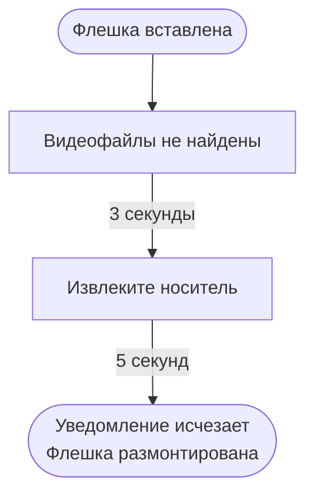
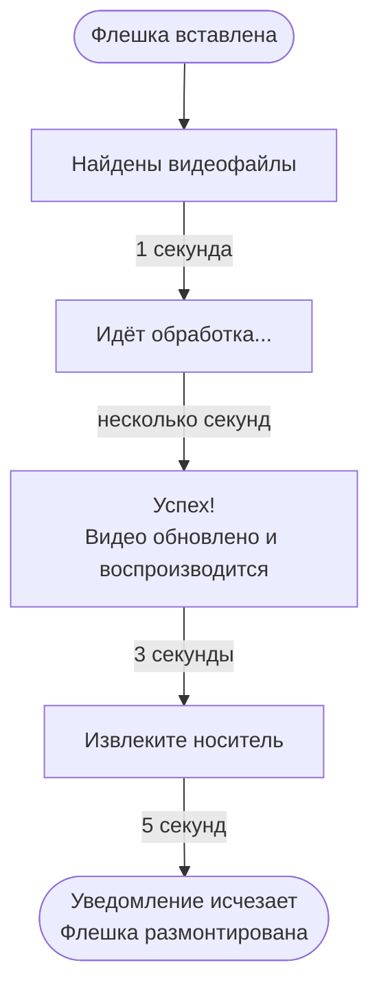
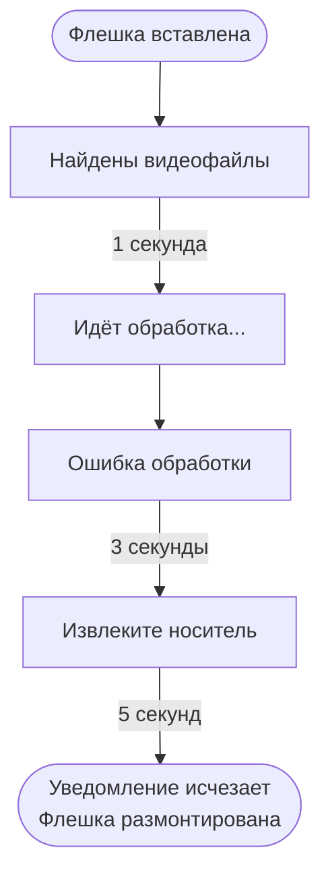
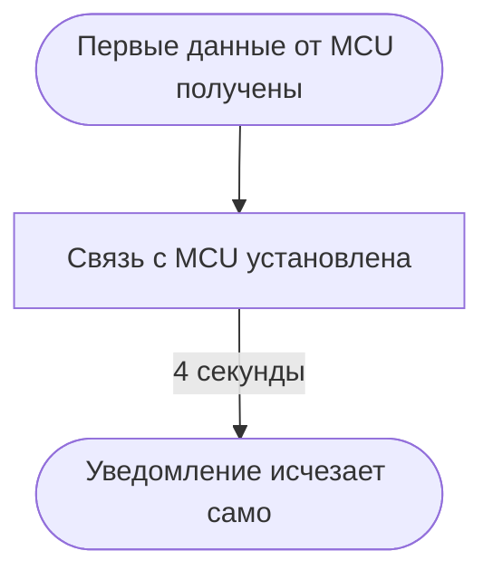

# Руководство по обновлению видеоконтента и уведомлениям

**Продукт:** Лифтовой индикатор HD на базе Raspberry Pi Zero 2W
**Версия прошивки:** 2.0.0-hd
**Дисплей:** 1080×1920 (portrait)

---

## Часть 1 — Система уведомлений

### Что такое уведомление

В нижней части экрана появляется информационная полоса высотой 270 пикселей
с текстовым сообщением. Она отображается поверх всего остального содержимого
экрана (цифр этажей, стрелок, режимов) и всегда хорошо видна.

Уведомления появляются автоматически в двух ситуациях:

- при подключении USB-носителя с видеофайлами
- при проблемах со связью с блоком управления лифтом (MCU)

---

### Уведомления при работе с USB-носителем

Когда вы вставляете USB-флешку в индикатор, система автоматически анализирует
содержимое и информирует вас о происходящем.

#### Сценарий 1: На флешке нет видеофайлов



Система смонтировала флешку, просмотрела содержимое, не нашла MP4-файлов,
предложила извлечь носитель и корректно его отключила.
**Видеоконтент индикатора не изменился.**

---

#### Сценарий 2: На флешке есть видеофайлы (штатная операция)



После уведомления «Успех!» новое видео уже воспроизводится в фоне.
Можно подождать «Извлеките носитель» или вынуть флешку раньше — оба варианта безопасны.

---

#### Сценарий 3: Видеофайл повреждён или несовместимого формата



**Текущее видео не изменяется.** Старый ролик продолжает воспроизводиться.
Что делать: подготовьте файл в правильном формате (см. Часть 2) и попробуйте снова.

---

#### Что происходит если вытащить флешку досрочно

Система обработает ситуацию корректно в любой момент:

- **До начала обработки:** простое размонтирование, уведомление скрывается.
- **Во время обработки (идёт «Идёт обработка...»):** обработка немедленно
  прерывается, незавершённый файл удаляется, текущее видео не изменяется.
- **После «Успех!», до «Извлеките носитель»:** всё уже сохранено,
  новое видео уже играет. Флешку можно безопасно вынуть.

---

### Уведомления о связи с блоком управления (MCU)

#### «Нет связи с MCU»

Появляется при включении или перезагрузке индикатора, если во время предыдущей
сессии не удалось синхронизировать настройки с блоком управления лифтом.
Обычно это происходит если:

- блок управления был выключен во время настройки
- соединение прервалось во время передачи параметров

Уведомление исчезнет автоматически как только индикатор получит первые данные
от блока управления. Если уведомление не исчезает долгое время — проверьте
кабель UART и питание блока управления.

#### «Связь с MCU установлена»



Появляется сразу после того как пришли первые данные от блока управления.
Уведомление информирует что проблема решена и исчезает автоматически через 4 секунды.

---

## Часть 2 — Обновление видеоконтента

### Поддерживаемый формат

Дисплей индикатора работает в **вертикальной ориентации (portrait) 1080×1920**.
Видеофайл **обязан** соответствовать этой ориентации — landscape-видео (1920×1080 и подобные)
воспроизведётся некорректно: изображение будет повёрнуто или обрезано.

| Параметр | Требование |
|---|---|
| **Контейнер** | MP4 (расширение `.mp4`) |
| **Видеокодек** | H.264 (AVC), профиль Baseline или Main, уровень ≤ 4.1 |
| **Ориентация** | **Portrait: 1080×1920** (обязательно) |
| **Частота кадров** | Любая (рекомендуется 25 или 30 fps) |
| **Аудиодорожка** | Не используется; рекомендуется удалить при подготовке (`-an`) |

> **Важно:** Файлы в форматах AVI, MOV, MKV, а также MP4 с кодеком H.265/HEVC не поддерживаются.
> Landscape-видео (1920×1080, 1280×720 и т.п.) необходимо повернуть и привести к 1080×1920
> перед записью на флешку — инструкции ниже.

---

### Как подготовить видеофайл

#### Требования к итоговому файлу

Перед конвертацией убедитесь что исходный материал снят в вертикальной ориентации.
Если исходник landscape — сначала поверните его (см. раздел «Ротация»).

#### DaVinci Resolve (Windows / macOS / Linux) — рекомендуется

1. Создайте проект с разрешением **1080×1920, 25 fps**
2. Импортируйте клип
3. File → Export → Render Settings
4. Format: **MP4**, Codec: **H.264**
5. Resolution: **1080×1920**
6. В разделе Advanced: Profile → **Baseline**
7. Audio: снять галочку (не используется)
8. Render

#### Adobe Premiere Pro

1. Последовательность: **1080×1920, 25 fps** (Vertical или кастомный)
2. File → Export → Media
3. Format: **H.264**, Preset: **Match Source** или кастомный
4. Output: проверить что разрешение **1080×1920**
5. Audio: снять галочку
6. Export

#### iMovie (macOS)

iMovie не поддерживает кастомное разрешение 1080×1920 для экспорта.
Используйте DaVinci Resolve или ffmpeg.

#### Командная строка (ffmpeg) — portrait-исходник

Если исходник уже снят вертикально (1080×1920):

```bash
ffmpeg -i входной_файл.mp4 \
       -c:v libx264 \
       -profile:v baseline \
       -level:v 4.1 \
       -vf scale=1080:1920 \
       -an \
       выходной_файл.mp4
```

#### Командная строка (ffmpeg) — ротация landscape → portrait

Если исходник landscape (1920×1080) и нужно повернуть его на 90°:

```bash
ffmpeg -i входной_файл.mp4 \
       -c:v libx264 \
       -profile:v baseline \
       -level:v 4.1 \
       -vf "transpose=1,scale=1080:1920" \
       -an \
       выходной_файл.mp4
```

> `transpose=1` — поворот на 90° по часовой стрелке.
> `transpose=2` — поворот на 90° против часовой стрелки.

Параметры:

- `-c:v libx264` — кодировать в H.264
- `-profile:v baseline` — максимальная совместимость с аппаратным декодером
- `-level:v 4.1` — максимальный уровень для VideoCore IV (VC4)
- `-vf scale=1080:1920` — привести к нужному разрешению
- `-an` — убрать аудио (не используется на индикаторе)

---

### Один файл или несколько

#### Один файл

Скопируйте один `.mp4` файл на флешку. При вставке он сразу запустится в обработку
и заменит текущее видео индикатора.

```bash
Флешка:
└── video.mp4
```

#### Несколько файлов — автоматическая склейка

Если на флешке несколько `.mp4` файлов, система автоматически склеит их
в один ролик и загрузит его как новое видео.

```bash
Флешка:
├── clip_01.mp4
├── clip_02.mp4
└── clip_03.mp4

Результат: clip_01 → clip_02 → clip_03 → loop
```

**Порядок склейки: алфавитный** по имени файла.

Чтобы задать нужный порядок — назовите файлы соответственно:

```
01_приветствие.mp4
02_реклама.mp4
03_информация.mp4
```

> **Требования при склейке нескольких файлов:**
> все ролики должны иметь **одинаковое разрешение (1080×1920), ориентацию и частоту кадров**.
> Если параметры отличаются — система покажет «Ошибка обработки».
> В этом случае приведите все файлы к единым параметрам через ffmpeg или видеоредактор.

---

### Время ожидания

Время обработки зависит от объёма данных на флешке, но не от длины видео.
На Pi Zero 2W с 1080p-файлами ориентируйтесь на следующие значения:

| Тип операции | Ориентировочное время |
|---|---|
| Один файл (любой длины) | **3–15 секунд** |
| Несколько файлов (сумма < 500 МБ) | **10–20 секунд** |
| Несколько файлов (сумма > 500 МБ) | **20–90 секунд** |

Во время обработки на экране отображается «Идёт обработка...» —
это нормально, индикатор продолжает работать в штатном режиме.

---

### Пошаговая инструкция обновления видео

1. **Подготовьте файл(ы)** в формате H.264 MP4, разрешение 1080×1920, portrait (см. выше).

2. **Отформатируйте флешку** в FAT32, если это новая флешка.
   *(exFAT также поддерживается.)*

3. **Скопируйте файлы на флешку.** Других требований нет.

4. **Вставьте флешку** в USB-порт индикатора.

5. **Следите за экраном:**
   «Найдены видеофайлы» → «Идёт обработка...» → «Успех!»

6. **Дождитесь** уведомления «Извлеките носитель».

7. **Извлеките флешку.** Готово — новое видео уже воспроизводится.

---

### Часто задаваемые вопросы

**Можно ли вставлять флешку пока индикатор работает?**
Да, без остановки. Индикатор продолжает показывать этажи во время обработки.

**Что если вынуть флешку во время «Идёт обработка...»?**
Обработка прервётся, текущее видео не изменится. Можно попробовать снова.

**Видео обновилось, но флешка ещё не извлечена — это опасно?**
Нет. После «Успех!» видео уже полностью сохранено. Флешка нужна только
для обработки, после этого она не используется.

**Что если на флешке есть другие файлы (фото, документы)?**
Они игнорируются. Система ищет только файлы с расширением `.mp4`.

**Поддерживаются ли файлы `.MP4` (в верхнем регистре)?**
Да, оба варианта (`.mp4` и `.MP4`) распознаются.

**macOS создаёт скрытые файлы на флешке — это проблема?**
Нет. Система автоматически игнорирует все скрытые файлы (начинающиеся
с точки), включая служебные файлы macOS типа `._video.mp4`.

**Можно ли загрузить видео длиннее 1 часа?**
Ограничений по длине нет. Время обработки зависит только от размера файла.

**Что означает «Ошибка обработки»?**
Возможные причины: файл не является корректным H.264 MP4, неподходящий профиль
кодека, или несовпадение параметров при склейке нескольких файлов.
Пересохраните файл командой:

```bash
ffmpeg -i ваш_файл.mp4 \
       -c:v libx264 \
       -profile:v baseline \
       -level:v 4.1 \
       -vf scale=1080:1920 \
       -an \
       готовый_файл.mp4
```

**Можно ли использовать landscape-видео (снятое горизонтально)?**
Напрямую — нет. Дисплей работает в portrait 1080×1920, landscape-видео
отобразится некорректно. Используйте ffmpeg с флагом `transpose=1` для ротации
(инструкция в разделе «Командная строка»).
