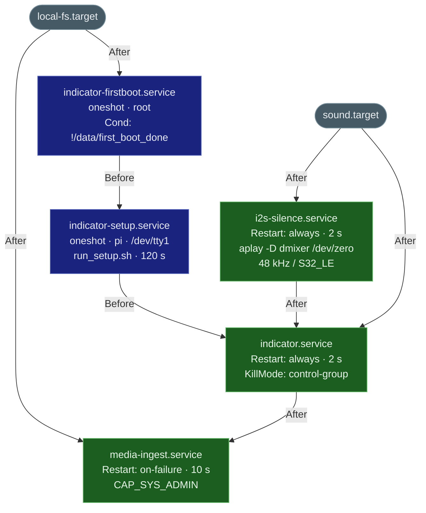
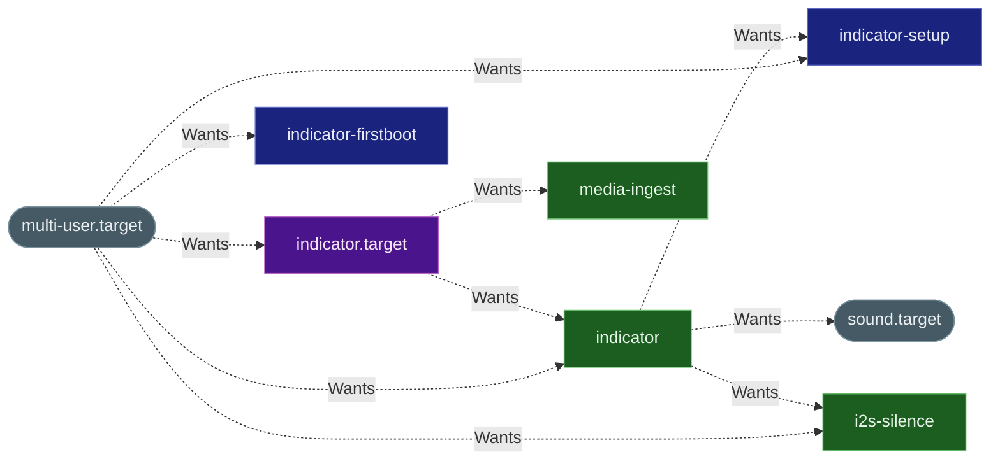
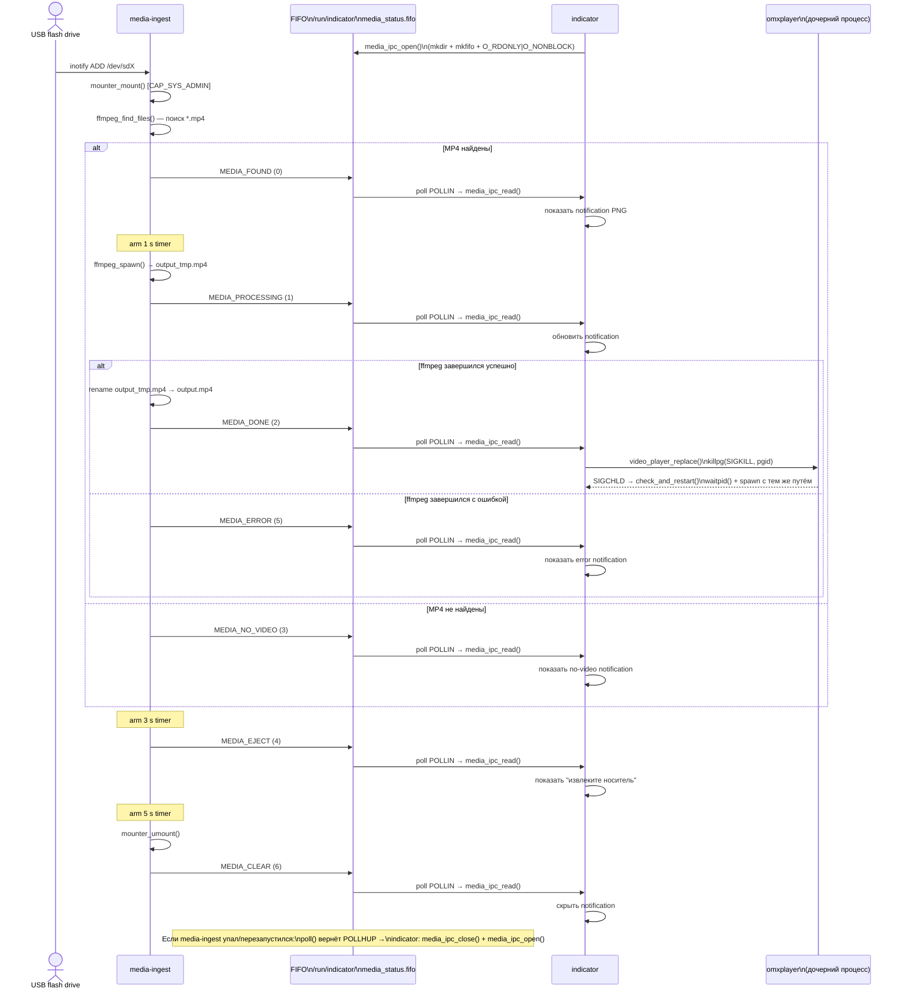

# Systemd Services — Interaction Diagrams

> Порядок старта, дерево активации, runtime IPC.

---

## 1. Порядок старта (After / Before)

Стрелки означают «должен завершить запуск до меня».
Параллельные ветки (provisioning + i2s) сходятся в `indicator.service`.

---

## 2. Дерево активации (Wants / WantedBy)

Пунктирные стрелки означают «хочу, чтобы ты запустился вместе со мной».
Все сервисы имеют `WantedBy=multi-user.target` (стандартный enable).
Ключевые нестандартные связи — `indicator.target` и `indicator → {setup, i2s}`.

> **Заметка:** `indicator.target` — grouping unit, обеспечивает,
> что `media-ingest` запускается как часть системы индикатора,
> даже если `indicator.service` перезапустится.

---

## 3. Runtime IPC (FIFO)

Однобайтовый протокол: `media-ingest` пишет, `indicator` читает в poll-цикле.
FIFO (`/run/indicator/media_status.fifo`) создаёт `indicator` при старте;
переживает рестарты обоих процессов.

---

## Итоговая сводка

| Сервис | Тип | Restart | Условие | Активирует |
|---|---|---|---|---|
| `indicator-firstboot` | oneshot | — | `!/data/first_boot_done` | → indicator-setup |
| `indicator-setup` | oneshot | — | всегда | → indicator |
| `i2s-silence` | simple | always · 2 s | card 0 ready | → indicator |
| `indicator` | simple | always · 2 s | — | → media-ingest |
| `media-ingest` | simple | on-failure · 10 s | бинарь существует | — |
| `indicator.target` | target | — | — | groups indicator + media-ingest |