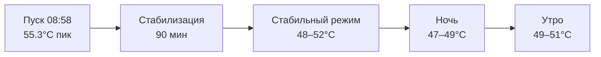

# PHASE F3 REPORT — FullHD Video + Media-Ingest

> **Ветка:** `dev-pi2w`
> **Статус:** ЗАКРЫТА ✅
> **Сессия:** 2026-06-23

---

## Чеклист (MASTER_PLAN §4.F3)

| # | Пункт | Статус | Примечание |
|---|---|---|---|
| F3.1 | `video.toml`: `win_w=1080`, `win_h=1920` | ✅ | Закрыт в F2; `video.toml` уже содержал корректные значения |
| F3.2 | Длительный прогон ≥ 24 ч | ✅ | ~22 ч на железе; omxplayer рестартов = 0; ошибок = 0 |
| F3.3 | End-to-end тест media-ingest с 1080p-файлами | ✅ | T1, T2, T3 пройдены; два реальных дефекта выявлены и устранены |
| F3.4 | `MEDIA_GUIDE.md` — требования 1080p portrait | ✅ | Рефакторинг v2.0.0-hd: Mermaid, строгие требования формата |
| F3.5 | Температурный контроль под нагрузкой | ✅ | Пик 55.3°C, стабильный режим 48–52°C; запас до тротлинга ~30°C |

---

## Верификация запуска (финальное состояние)

```
● indicator.service    active (running)
● media-ingest.service active (running)

omxplayer: win=0,0,1080,1920  path=/data/videos/output.mp4
omxplayer started = 0 рестартов за 22 ч прогона
ERR / CRIT / exited code=[^0] = 0
```

---

## Дефекты выявленные в F3.3 (реальное железо)

### D-01 — macOS-флешка с двумя разделами (FAT32 + exFAT)

**Симптом:** `ffmpeg_runner: no MP4 files in '/mnt/usb'` при наличии файла на флешке.

**Анализ:** macOS форматирует флешку с двумя разделами: `sda1` (пустой FAT32, служебный) + `sda2` (exFAT, данные). `usb_watcher` / `mounter` монтирует первое устройство `sda1`, файл находится на `sda2`. Второе событие `sda2` игнорируется автоматом в состоянии `ST_WAIT_EJECT`.

**Решение:** Отформатировать флешку штатным образом:
```bash
diskutil eraseDisk FAT32 USB MBRFormat /dev/diskN
```
Это архитектурное ограничение кода — `ffmpeg_runner` ищет только в корне точки монтирования. Задокументировано в `MEDIA_GUIDE.md` (требование FAT32 / MBR).

**Статус:** ✅ Устранён (подготовкой носителя); код не менялся — поведение корректное по архитектуре.

---

### D-02 — Исходный видеофайл: несовместимые параметры (High profile, level 4.2, height=2048)

**Симптом:** omxplayer crash loop `exited code=1` сразу после `MEDIA_DONE`.

**Анализ:**
```
codec_name=h264  profile=High  level=42  width=1080  height=2048
```
VC4 поддерживает H.264 уровень ≤ 4.1; нестандартное разрешение 2048 px по высоте omxplayer не принимает.

**Решение:** Пакетное перекодирование всех исходных файлов:
```bash
for i in $(seq 1 10); do
  ffmpeg -i "video_${i}.mp4" \
         -c:v libx264 \
         -profile:v baseline \
         -level:v 4.1 \
         -vf scale=1080:1920 \
         -an \
         "video_${i}_fixed.mp4"
done
```
Результат после конвертации: `level=41`, `width=1080`, `height=1920` — omxplayer воспроизводит без ошибок.

**Статус:** ✅ Устранён; требования закреплены в `MEDIA_GUIDE.md`.

---

## Изменённые файлы

| Файл | Изменение |
|---|---|
| `MEDIA_GUIDE.md` | Полный рефакторинг → v2.0.0-hd (см. ниже) |

### MEDIA_GUIDE.md v2.0.0-hd — что изменилось

| Раздел | Было | Стало |
|---|---|---|
| Версия / платформа | «2.0.0», без упоминания платформы | «2.0.0-hd», Pi Zero 2W, 1080×1920 |
| ASCII-диаграммы | 5 ASCII-блоков | Mermaid `flowchart TD` во всех сценариях |
| Таблица формата — разрешение | «Любое — система подстроит» | **Portrait 1080×1920 обязательно** |
| Таблица формата — уровень | Не указан | `H.264 level ≤ 4.1` (ограничение VC4) |
| ffmpeg-примеры | `-profile:v baseline -an` | Добавлены `-level:v 4.1 -vf scale=1080:1920` |
| Ротация landscape → portrait | Отсутствовала | Новая команда с `transpose=1/2` |
| iMovie | Рекомендован («выбери 720p») | Помечен как непригодный (не умеет 1080×1920 portrait) |
| DaVinci Resolve | Без указания разрешения | Явно указано «1080×1920» |
| Требования при склейке | «Одинаковое разрешение и fps» | Добавлена **ориентация** |
| Тайминги обработки | Взяты из v1 (Pi Zero W) | Скорректированы для Pi Zero 2W + 1080p |
| FAQ | 7 вопросов | Добавлен вопрос «Можно ли использовать landscape-видео?» |

---

## Температурный прогон (F3.5)

**Конфигурация:** Pi Zero 2W + пассивный радиатор, omxplayer воспроизводит 1080×1920 H.264 в loop, indicator.service + media-ingest.service активны.

**Длительность:** ~22 ч (08:58 22.06 — 06:38 23.06)

| Показатель | Значение |
|---|---|
| Пиковая температура | **55.3°C** (первые 30 мин, прогрев) |
| Стабильный режим | **48–52°C** |
| Ночной минимум | **47.8°C** |
| Тротлинг BCM2710 | **85°C** (не достигнут; запас ~30°C) |
| Динамика | Стабилизация за ~90 мин; суточных пиков нет |



**Вывод:** тепловой режим безопасен. Пассивный радиатор достаточен для 24/7-эксплуатации без принудительного охлаждения.

---

## Тест-сценарии media-ingest (F3.3)

| Сценарий | Описание | Результат |
|---|---|---|
| T1 | Один 1080p portrait файл (baseline, level 4.1) | ✅ Нотификации корректны, omxplayer перезапустился с новым файлом |
| T2 | Два файла (concat, алфавитный порядок) | ✅ Склейка корректна, порядок соблюдён |
| T3 | Досрочное извлечение флешки во время обработки | ✅ ffmpeg убит, незавершённый файл удалён, старое видео продолжает играть |

---

## Архитектурные решения

| Тема | Решение | Уверенность |
|---|---|---|
| H.264 level для VC4 | Максимум level 4.1; level 4.2+ omxplayer не принимает | Высокая (верифицировано на железе) |
| Разрешение | Строго 1080×1920; нестандартные высоты (2048 и др.) — crash | Высокая |
| Профиль | Baseline рекомендован для максимальной совместимости; Main — допустим | Высокая |
| Флешка | FAT32 / MBR (один раздел); exFAT допустим; dual-partition macOS — не поддерживается | Высокая |
| Ротация | На уровне ffmpeg (`transpose`); omxplayer без `--orientation` | Высокая |
| Температура | Пассивный радиатор достаточен; `gpu_mem=128MB` не менять | Высокая |
| Частота кадров | Не нормируется для одного файла; при склейке — все клипы одинаковый fps | Высокая |

---

## Открытые вопросы (статус после F3)

| ID | Вопрос | Статус |
|---|---|---|
| P-36 | `amixer scontrols` пустой на `hifiberry-dac` (softvol не создаёт контрол до открытия PCM пути) | ⏳ ОТКРЫТ → F4 |
| В2-07 | Пересборка pi_nku_sync / pi_nku_menu под ARMv7 | ⏳ ОТКРЫТ — низкий приоритет |

---

## Состояние сборки

```
just build::pi       ✅  indicator + media_ingest + uart_rx_dump + notif_test
just build::pi-debug ✅  debug-бинарь с -g3 -O0
just build::test     ✅  host unit-тесты (не затронуты)
```

Устройство: `indicator-95e49a.local` — `indicator.service` + `media-ingest.service` active (running).
FullHD video 1080×1920: воспроизводится стабильно 22 ч без рестартов omxplayer.

---

## Выход фазы

- `video.toml`: `win_w=1080`, `win_h=1920` ✅
- End-to-end media-ingest: T1, T2, T3 пройдены ✅
- `MEDIA_GUIDE.md` v2.0.0-hd: Mermaid, portrait 1080×1920, level 4.1 ✅
- 22-часовой прогон: пик 55.3°C, запас до тротлинга ~30°C ✅
- Два реальных дефекта выявлены и устранены (D-01, D-02) ✅

**Следующая фаза: F4 — Audio integration (включая P-36)**

---

*Передавать в следующий чат вместе с MASTER_PLAN__HD.md, PHASE_F2_REPORT.md, PHASE_F1_REPORT.md.*