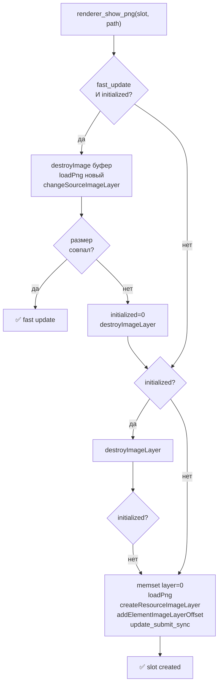
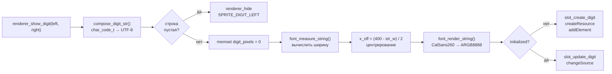
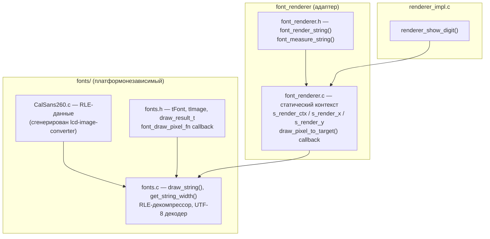
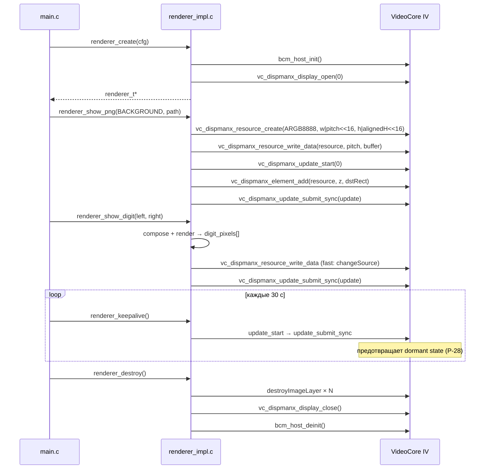

# platform/dispmanx — DispmanX renderer

Платформенная реализация рендерера для Raspberry Pi.  
Скрыта за опаковым указателем `renderer_t`; `src_indicator` видит только
`renderer/renderer.h` и ничего из DispmanX / bcm_host.

---

## Структура модуля

```
platform/dispmanx/
├── renderer_impl.c      # реализация renderer.h: слоты, DIGIT, keepalive
├── font_renderer.h/.c   # адаптер fonts → ARGB8888-буфер
├── fonts/
│   ├── fonts.h/.c       # RLE-декомпрессор, draw_string, get_string_width
│   ├── CalSans260.h      # extern const tFont CalSans260
│   └── CalSans260.c      # RLE-данные глифов (сгенерирован lcd-image-converter)
└── layers/              # vendored: Andrew Duncan (MIT)
    ├── image.h/.c        # IMAGE_T: буфер, pitch, alignedHeight
    ├── imageLayer.h/.c   # DispmanX resource + element lifecycle
    └── loadpng.h/.c      # PNG → IMAGE_T через libpng
```

---

## Z-слои и слоты

Compositor VideoCore IV накладывает слои в порядке Z.  
Каждый слот — один DispmanX element с фиксированным Z.

| Слот | `sprite_slot_t` | Z | Содержимое |
|---|---|---|---|
| 0 | `SPRITE_BACKGROUND` | 2 | `BACK.png` — полный экран 1080×1920 |
| 1 | `SPRITE_MODE` | 3 | иконка режима (`modes/*.png`) или скрыт |
| 2 | `SPRITE_WEIGHT` | 4 | индикатор нагрузки (`weights/load_N.png`) |
| 3 | `SPRITE_DIGIT_LEFT` | 4 | font renderer CalSans260 (буфер 400×191) |
| 4 | `SPRITE_DIGIT_RIGHT` | 4 | reserved, не используется до F6 |
| 5 | `SPRITE_ARROW` | 4 | стрелка направления (`arrows/*.png`) |
| 6 | `SPRITE_NOTIFICATION` | 5 | USB-баннер (`notifications/*.png`, 1080×270) |

DIGIT_LEFT, DIGIT_RIGHT, ARROW — **fast\_update** слоты: element и resource
создаются один раз, при обновлении меняются только пиксели
(`changeSourceImageLayer`). Остальные — **slow**: полное пересоздание
при каждом вызове.

---

## Жизненный цикл слота



---

## DIGIT-слот: font renderer

Цифры этажа рисуются не PNG-файлом, а шрифтовым рендерером прямо в
ARGB8888-буфер, который затем загружается в DispmanX как ресурс.



### Буфер DIGIT-слота

VideoCore требует выравнивания pitch и высоты на 16 пикселей:

```bash
DIGIT_SLOT_W    = 400 px   (вмещает «П0» = 348 px + запас)
DIGIT_SLOT_H    = 191 px   (высота глифа CalSans260)
DIGIT_PITCH_PX  = 400      (400 уже кратно 16)
DIGIT_PITCH     = 1600 байт (400 × 4 байта/px, ARGB8888)
DIGIT_ALIGNED_H = 192      (ALIGN_TO_16(191))
DIGIT_BUF_LEN   = 76 800   uint32_t  (400 × 192)
```

Размеры буфера определяются самым широким глифом шрифта.
При смене шрифта обновить `DIGIT_SLOT_W/H` — `digit_slot_validate_font()`
в `renderer_create()` проверит соответствие при старте и вернёт `NULL`
с сообщением в syslog если буфер мал.

### Формат пикселей

`ARGB8888 premultiplied` — непрозрачный белый = `0xFFFFFFFF`,
прозрачный фон = `0x00000000`. Совместим с `VC_IMAGE_ARGB8888` +
`DISPMANX_FLAGS_ALPHA_FROM_SOURCE` без конвертации.

---

## Шрифтовый стек



`fonts.c` не знает ничего о DispmanX — он вызывает `font_draw_pixel_fn`
для каждого непрозрачного пикселя. `font_renderer.c` подставляет
`draw_pixel_to_target` как коллбэк, который пишет в `digit_pixels[]`
с bounds-check (пиксели за границей буфера молча пропускаются).

Статические переменные `s_render_ctx / s_render_x / s_render_y` —
допустимо: indicator однопоточный, рендеринг синхронный в event-loop.

### RLE-формат CalSans260

Два типа записей в `image->data[]`:

```bash
header & 0xFFFFFF00 == 0xFFFFFF00  →  UNIQUE:
    len = 0x100 - (header & 0xFF)
    следующие len слов — уникальные пиксели ARGB8888

иначе  →  REPEATABLE:
    len = header & 0xFFFF
    следующее слово — пиксель, повторить len раз
```

---

## Взаимодействие с DispmanX



### Keepalive (P-28)

VideoCore IV переходит в dormant при отсутствии DispmanX-активности (~2 дня).
omxplayer продолжает декодировать, но кадры перестают рендериться на экран.
Пустая транзакция `update_start → update_submit_sync` каждые 30 с
удерживает compositor активным. Стоимость: ~1 мс round-trip.

---

## Зависимости сборки

Собирается только для Pi (DispmanX недоступен на host).
Все зависимости — в `platform/dispmanx/CMakeLists.txt`.

| Зависимость | Откуда | Линковка |
|---|---|---|
| `bcm_host` | `/opt/vc/lib/` (Pi sysroot) | статическая `-L/opt/vc/lib` |
| `libpng16` | `build-env/pi-sysroot/usr/lib/` | динамическая `-lpng16` |
| `libz` | `build-env/pi-sysroot/usr/lib/` | динамическая `-lz` |

`libpng16.a` из Buster/armhf скомпилирована с `-march=armv7-a` (Thumb-2)
и вызывает SIGSEGV на ARMv6 в `.init_array` до `main()`.
На Cortex-A53 (Pi Zero 2W) это неактуально, но динамическая линковка
сохранена для единообразия.
