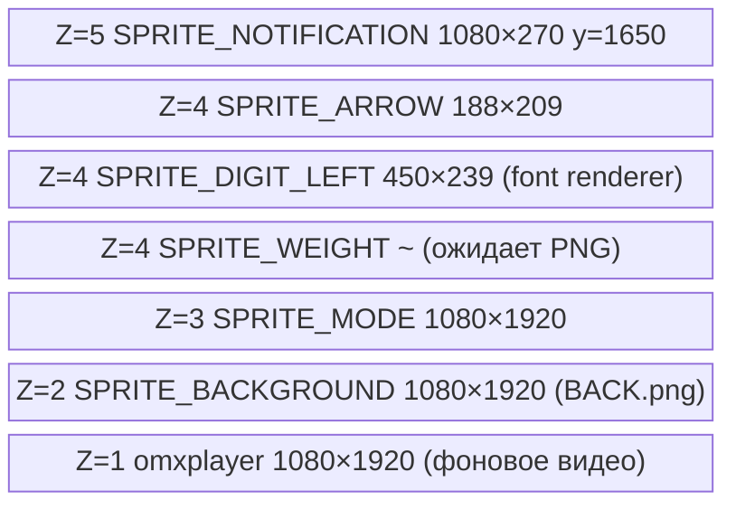
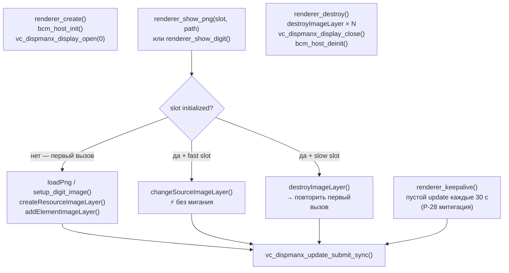
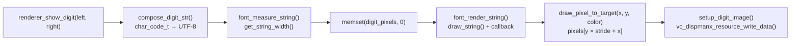

# platform/dispmanx — DispmanX renderer + font stack

Платформенная реализация рендерера для Raspberry Pi Zero 2W.
Зависит от `bcm_host` (`/opt/vc`) — не компилируется на хосте.
Публичный интерфейс изолирован в `src_indicator/renderer/renderer.h`.

---

## Структура блока

```
platform/dispmanx/
├── renderer_impl.c     — реализация renderer_t: слоты, ресурсы, fast_update
├── font_renderer.c/.h  — адаптер fonts.c → ARGB8888 буфер (stride-aware)
└── fonts/
    ├── fonts.h/.c      — RLE-декомпрессор, draw_string(), callback-архитектура
    ├── CalSans260.h     — extern const tFont CalSans260
    └── CalSans260.c    — данные глифов 325pt (сгенерированы lcd-image-converter)
```

> **Примечание по именованию:** файл `CalSans260.c` содержит шрифт Cal Sans **325pt**
> (перегенерирован из 260pt). Имя файла сохранено для совместимости с CMakeLists.

---

## Z-слои и геометрия слотов



| Слот | Z | Тип обновления | Размер |
|---|---|---|---|
| `SPRITE_BACKGROUND` | 2 | slow (destroy+create) | 1080×1920 |
| `SPRITE_MODE` | 3 | slow | 1080×1920 |
| `SPRITE_WEIGHT` | 4 | slow | ~ |
| `SPRITE_DIGIT_LEFT` | 4 | **fast** (`changeSourceImageLayer`) | 450×239 |
| `SPRITE_DIGIT_RIGHT` | 4 | reserved до F6 | — |
| `SPRITE_ARROW` | 4 | **fast** | 188×209 |
| `SPRITE_NOTIFICATION` | 5 | slow | 1080×270 |

---

## DispmanX lifecycle



### Fast vs slow update

**Fast слоты** (`DIGIT_LEFT`, `ARROW`): ресурс фиксированного размера создаётся
один раз, пиксели перезаписываются в тот же буфер через `changeSourceImageLayer`.
Не мигают, не аллоцируют GPU-память повторно.

**Slow слоты** (`BACKGROUND`, `MODE`, `WEIGHT`, `NOTIFICATION`): каждое обновление —
`destroy` + `create`. Размер PNG может меняться между вызовами. Допускают
кратковременное мигание (невидимо на практике, т.к. вызываются при смене режима).

---

## Font stack



### Шрифт CalSans260 (325pt)

| Глиф | Ширина | Высота |
|---|---|---|
| `0` | 200 px | 239 px |
| `1` | 95 px | 239 px |
| `2` | 179 px | 239 px |
| `3` | 170 px | 239 px |
| `4` | 186 px | 239 px |
| `5` | 172 px | 239 px |
| `6` | 178 px | 239 px |
| `7` | 168 px | 239 px |
| `8` | 173 px | 239 px |
| `9` | 178 px | 239 px |
| `П` | **235 px** | 239 px |
| `-` | 106 px | 239 px |

Самый широкий одиночный глиф: **П (235 px)**.
Самая широкая двухсимвольная строка: **«П0» = 235 + 200 = 435 px**.
`DIGIT_SLOT_W = 450` — с запасом ~15 px для центрирования.

### Маппинг char_code_t → CalSans260

Из 38 кодов `char_code_t` глифы есть у 12:

| Группа | Коды | Глифы |
|---|---|---|
| Цифры | `CHAR_0`–`CHAR_9` | ✅ |
| Буква | `CHAR_PI_CYR` (17) | ✅ `П` |
| Знак | `CHAR_MINUS` (22) | ✅ `-` |
| Остальные 25 | — | пропускаются |
| `CHAR_BLANK` (16) | — | оба BLANK → слот скрывается |

---

## Stride/pitch — критически важно

VideoCore IV требует выравнивания строк буфера на **16 пикселей**.
`DIGIT_SLOT_W = 450` → `DIGIT_PITCH_PX = (450 + 15) & ~15 = **464**`.

Запись пикселей в коллбэке **обязана** использовать `stride`, а не `width`:

```c
/* ПРАВИЛЬНО */
pixels[abs_y * stride + abs_x] = color;

/* НЕПРАВИЛЬНО — артефакты на каждой строке глифа */
pixels[abs_y * width + abs_x] = color;
```

При `width=450` и `stride=464` каждая следующая строка глифа записывается
со сдвигом −14 пикселей относительно того что VideoCore ожидает прочитать.
Результат — скошенный/смещённый текст с мусором по краям.

`font_render_target_t` содержит явное поле `stride` именно по этой причине:

```c
font_render_target_t target = {
    .pixels = r->digit_pixels,
    .width  = DIGIT_SLOT_W,
    .height = DIGIT_SLOT_H,
    .stride = DIGIT_PITCH_PX,   /* ← обязательно, не width */
};
```

Аналогично в `setup_digit_image()`:

```c
p_il->image.pitch         = (int32_t)(DIGIT_PITCH_PX * DIGIT_BYTES_PP);
p_il->image.alignedHeight = (int32_t) DIGIT_ALIGNED_H;
```

---

## Валидация при старте

`digit_slot_validate_font()` вызывается в `renderer_create()` до открытия display.
Проверяет что каждый глиф CalSans260 влезает в `DIGIT_SLOT_W × DIGIT_SLOT_H`.
При нарушении — `LOG_CRIT` и `renderer_create()` возвращает NULL.

**При смене шрифта обновить:**
1. `DIGIT_SLOT_W` / `DIGIT_SLOT_H` в `renderer_impl.c` (по самому широкому глифу + запас)
2. Комментарии в `renderer.h` (`renderer_show_digit`)
3. Таблицу глифов в этом README
