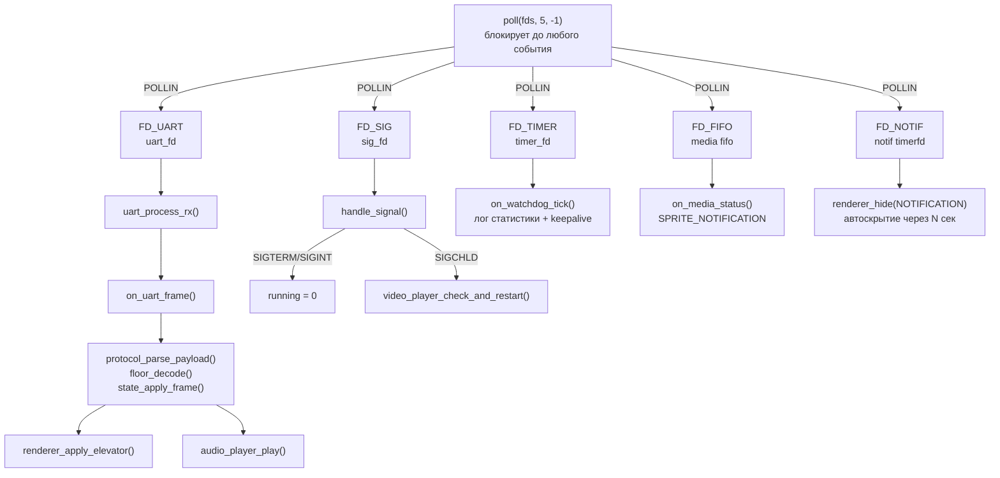
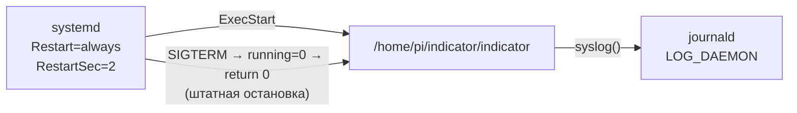

# src_indicator — Lift Indicator daemon

Демон индикатора лифта. Получает фреймы от STM32 по UART, обновляет
DispmanX-рендерер и воспроизводит звук.

Платформа: **Raspberry Pi Zero 2W** · BCM2710A1 · 4× Cortex-A53 · Debian Buster armhf.

---

## Структура модуля

```bash
src_indicator/
├── main.c           — composition root: инициализация, poll loop, cleanup
├── app_handlers.c   — обработчики событий: UART, media IPC, watchdog, уведомления
├── app_render.c     — обновление DispmanX-слотов по событиям лифта и диспетчера
├── app_private.h    — общие типы app_t / stats_t и forward-объявления для трёх TU
│
├── audio/           — ALSA-плеер (aplay, pthread)
├── config/          — парсер nku_scheme.toml / video.toml / renderer.toml
├── domain/          — бизнес-логика: parser, floor, state, sound_map
├── media/           — IPC с media-ingest (FIFO)
├── player/          — omxplayer wrapper
├── protocol/        — типы MU-протокола
├── renderer/        — публичный API DispmanX-рендерера (renderer.h)
└── transport/       — UART (termios)
```

### Декомпозиция main.c → три TU

| Файл | Содержимое |
|---|---|
| `main.c` | `main()`, setup-функции (`signalfd`, `timerfd`, `open_uart`, `read_setup_status`), poll loop, cleanup |
| `app_handlers.c` | `on_uart_frame()`, `on_media_status()`, `on_watchdog_tick()`, `maybe_clear_mcu_notification()`, `notif_arm()`, `notif_disarm()` |
| `app_render.c` | `renderer_apply_elevator()`, `renderer_apply_mode()`, `renderer_apply_dispatch()`, `mode_to_rel_path()` |
| `app_private.h` | `app_t`, `stats_t`, `setup_status_t`, `fd_index_t`, `extern g_s_stats`, forward-объявления |

---

## Архитектура event loop

Один поток, один `poll()`, пять файловых дескрипторов.



### Почему один поток

Pi Zero 2W имеет 4 ядра, но создавать потоки ради event loop нет смысла:

- Весь горячий путь (UART → парсер → рендерер) завершается за единицы мс. Блокирующих операций нет.
- Отсутствие shared state = отсутствие мьютексов в критическом пути = предсказуемая latency.
- Исключение: `audio_player` работает в отдельном pthread, потому что `waitpid(aplay_pid)` должен ждать завершения звука не блокируя loop.

---

## Порядок инициализации

```mermaid
flowchart LR
    A["1. config_load()\nnku_scheme + video + renderer + uart toml"]
    B["2. state_init()"]
    C["3. signalfd\n(до дочерних процессов)"]
    D["4. timerfd\n(watchdog)"]
    E["5. media_ipc_open()\nFIFO от media-ingest"]
    F["6. notif timerfd\n(автоскрытие уведомлений)"]
    G["7. video_player_open()\nomxplayer subprocess"]
    H["8. renderer_create()\nDispmanX display"]
    I["9. audio_player_open()\npthread"]
    J["10. uart_open()\nпоследним"]

    A --> B --> C --> D --> E --> F --> G --> H --> I --> J
```



UART открывается последним намеренно: `on_uart_frame()` вызывается синхронно
из `uart_process_rx()` — к этому моменту renderer и audio должны быть готовы,
иначе NULL-дереференс.

---

## Файловые дескрипторы poll loop

| Индекс | fd | Событие | Обработчик |
|---|---|---|---|
| `FD_UART` | `/dev/serial0` | POLLIN | `uart_process_rx()` → `on_uart_frame()` |
| `FD_SIG` | signalfd | POLLIN | `handle_signal()` |
| `FD_TIMER` | timerfd 30 с | POLLIN | `on_watchdog_tick()` |
| `FD_FIFO` | `/run/indicator/media_status.fifo` | POLLIN / POLLHUP | `on_media_status()` / переоткрытие |
| `FD_NOTIF` | timerfd one-shot | POLLIN | `renderer_hide(SPRITE_NOTIFICATION)` |

`FD_FIFO = -1` и `FD_NOTIF = -1` при ошибке открытия — `poll()` игнорирует
отрицательные fd, функциональность деградирует без падения.

---

## signalfd: почему не `signal()` / `sigaction()`

Традиционный обработчик вызывается асинхронно и ограничен async-signal-safe
функциями (`write()`, `_exit()`, ~30 штук). `syslog()`, `malloc()`,
`pthread_mutex_lock()` — небезопасны внутри обработчика.

С signalfd сигнал — это просто POLLIN на fd:

```c
/* Заблокировать стандартную доставку */
sigprocmask(SIG_BLOCK, &mask, NULL);

/* fd, из которого сигнал читается как структура */
sig_fd = signalfd(-1, &mask, SFD_NONBLOCK | SFD_CLOEXEC);

/* В poll loop — обычный read, никаких ограничений */
read(sig_fd, &si, sizeof(si));
syslog(LOG_NOTICE, "signal %u", si.ssi_signo); /* безопасно */
```

**SIGCHLD** через signalfd: omxplayer завершается → ядро посылает SIGCHLD →
POLLIN на `FD_SIG` → `video_player_check_and_restart()` без ограничений.

---

## timerfd: watchdog tick и P-28 митигация

```c
timerfd_create(CLOCK_MONOTONIC, TFD_NONBLOCK | TFD_CLOEXEC);
timerfd_settime(fd, 0, &ts, NULL); /* период = 30 с */
```

`CLOCK_MONOTONIC` — не прыгает при NTP-синхронизации и `hwclock`.

При срабатывании: читаем `uint64_t` (число пропущенных тиков, обычно 1),
вызываем `on_watchdog_tick()`:

1. Логируем статистику фреймов и состояние omxplayer — видно в `journalctl` при диагностике в поле.
2. `renderer_keepalive()` — пустая DispmanX-транзакция. Митигирует **P-28**: VideoCore IV
   переходит в dormant при длительном отсутствии активности и останавливает видео.

---

## Уведомления: двухуровневый timerfd

```mermaid
sequenceDiagram
    participant MI as media-ingest
    participant FIFO as FD_FIFO
    participant Loop as poll loop
    participant R as renderer
    participant NT as FD_NOTIF (timerfd)

    MI->>FIFO: write(MEDIA_DONE)
    FIFO->>Loop: POLLIN
    Loop->>R: renderer_show_png(NOTIFICATION, notif_success.png)
    Loop->>NT: timerfd_settime(delay=4s)

    Note over NT: 4 секунды...

    NT->>Loop: POLLIN
    Loop->>R: renderer_hide(NOTIFICATION)
```

`FD_NOTIF` — one-shot timerfd: взводится при каждом новом уведомлении,
сбрасывается при `MEDIA_CLEAR`. Автоскрытие работает без sleep и без
дополнительного потока.

---

## Зачем `#define _GNU_SOURCE`

| Символ | Заголовок | Почему |
|---|---|---|
| `signalfd()`, `SFD_*` | `<sys/signalfd.h>` | Linux-specific |
| `timerfd_create()`, `TFD_*` | `<sys/timerfd.h>` | Linux-specific |
| `CLOCK_MONOTONIC` | `<time.h>` | POSIX, но glibc скрывает без `_GNU_SOURCE` |
| `sigemptyset`, `sigprocmask` | `<signal.h>` | POSIX.1-2001, clangd не видит без флага |

`#define _GNU_SOURCE` — **до любых `#include`**. При `-std=gnu11` компилятор
определяет его неявно, но clangd читает файл без флагов компилятора
и подчёркивает символы красным без явного define.

---

## Взаимодействие с systemd



| Уровень syslog | Когда |
|---|---|
| `LOG_CRIT` | Ошибка запуска, невозможно продолжить |
| `LOG_ERR` | Ошибка устройства (UART, DispmanX) |
| `LOG_WARNING` | Ошибка разбора фрейма, нештатная ситуация |
| `LOG_NOTICE` | Старт, стоп, смена режима, watchdog tick |
| `LOG_INFO` | Каждый фрейм (нормальная работа), конфиг при старте |
| `LOG_DEBUG` | SIGCHLD, неизвестные opcode, fast-update детали |

```bash
journalctl -u indicator -f                    # tail в реальном времени
journalctl -u indicator -n 100                # последние 100 строк
journalctl -u indicator --since "10 min ago"  # диагностика в поле
journalctl -u indicator -f | grep watchdog    # только watchdog тики
```
