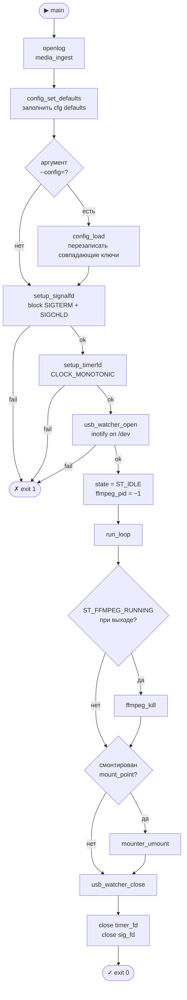
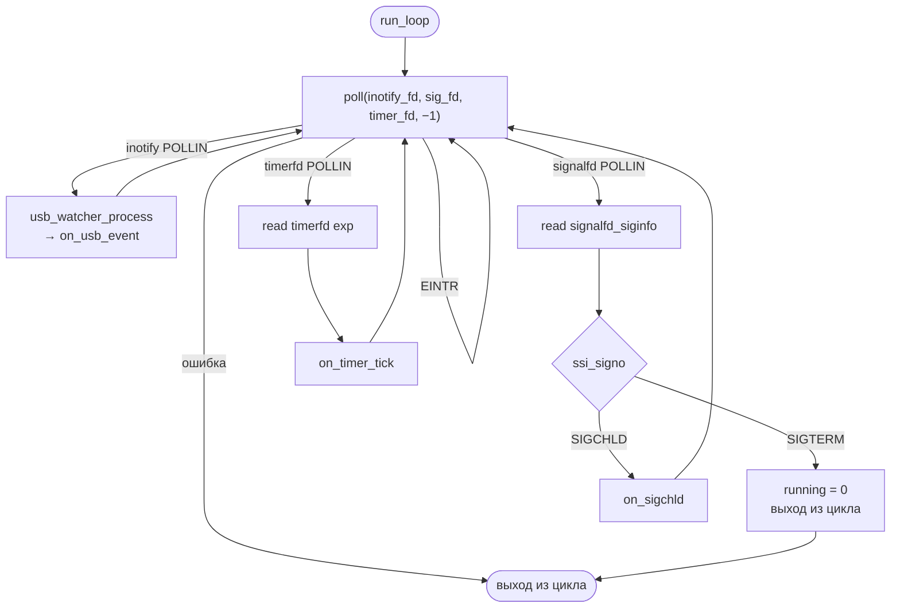
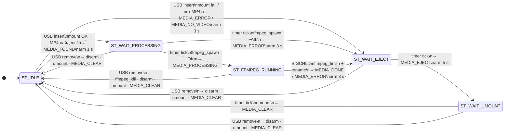

# media-ingest: Flow Diagrams

Этот документ содержит Mermaid-диаграммы для `src_media_ingest/main.c`.

> **Рендеринг:** GitHub, GitLab, Obsidian, VS Code (расширение _Markdown Preview Mermaid Support_).

---

## 1. Startup / Shutdown (`main`)

Последовательность инициализации и корректного завершения.



---

## 2. Event Loop (`run_loop`)

`poll()` ожидает три файловых дескриптора одновременно; все ветки возвращают управление обратно в цикл.



---

## 3. Конечный автомат

Все состояния, переходы, таймеры и IPC-сообщения в FIFO.



---

## 4. Тайминги состояний

```bash
USB вставлен
     │
     ├─ mount + scan ─────────────────────────────────────┐
     │                                                     │
  [1 s]                                              ошибка / нет MP4
     │                                                     │
     ▼                                                     ▼
ffmpeg запущен ──── SIGCHLD ──────────► [3 s] ──► MEDIA_EJECT ──► [5 s] ──► umount ──► ST_IDLE
                  (done/error)
```

| Переход                        | Задержка | Константа                      |
|-------------------------------|----------|-------------------------------|
| MEDIA_FOUND → ffmpeg start    | 1 s      | `DELAY_FOUND_TO_PROCESSING_S` |
| result → MEDIA_EJECT          | 3 s      | `DELAY_RESULT_TO_EJECT_S`     |
| MEDIA_EJECT → umount          | 5 s      | `DELAY_EJECT_TO_UMOUNT_S`     |
